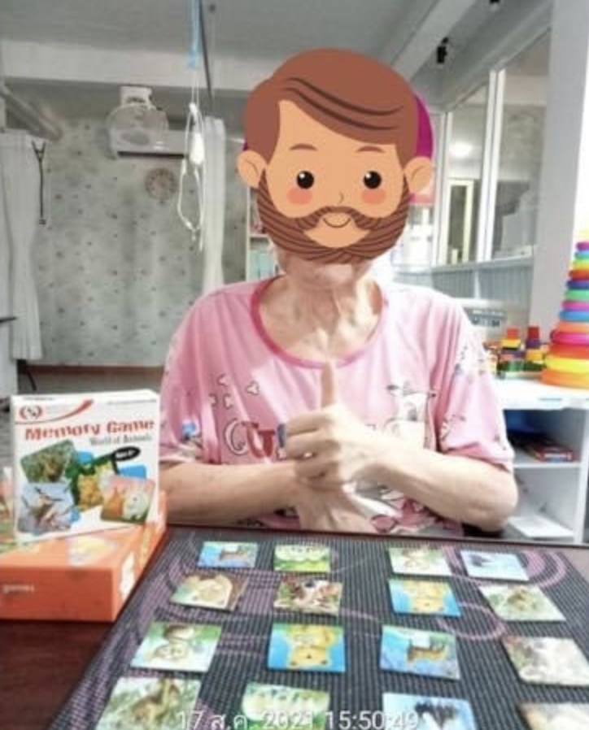
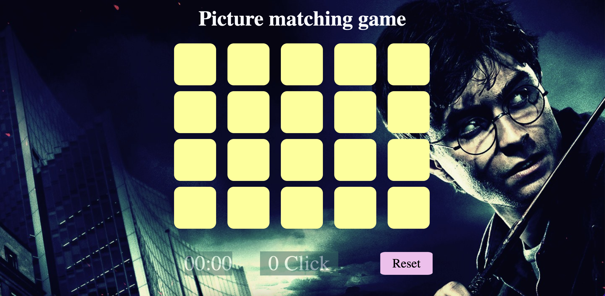
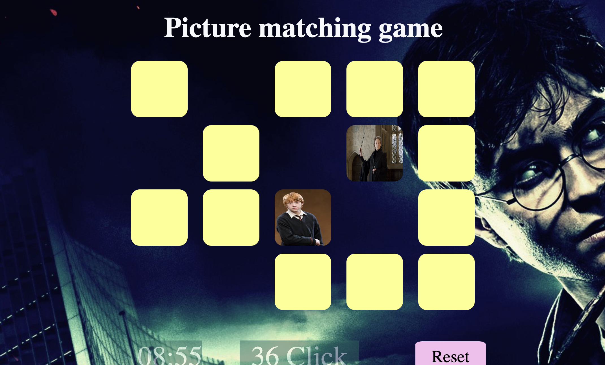

# Unit 1 Project - Picture matching game

## Inspiration

Inspired by the brain exercises game for Alzheimer's patients

## Stack

- HTML
- CSS
- JavaScript
- jQuery

## Production site

https://peeradakase.github.io/project-1-game/

## Screenshot

Start Screen

Playing Screen

Finish Screen

## Presentation link

https://docs.google.com/presentation/d/16pOB4bgaZRUPTeC2HSvZ71vUQlCtVqmtmlNY5hu3MG8/edit?usp=sharing
